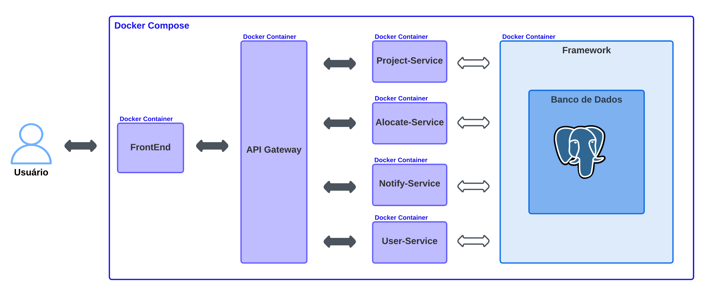
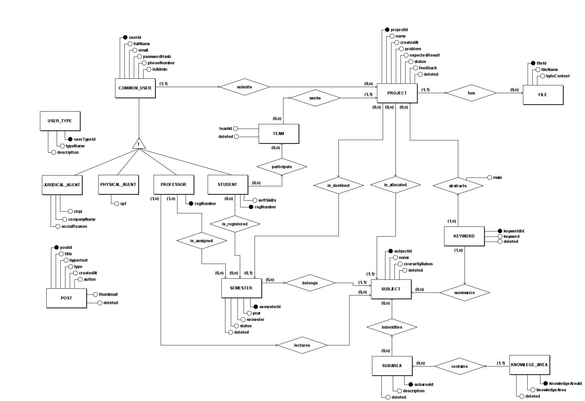
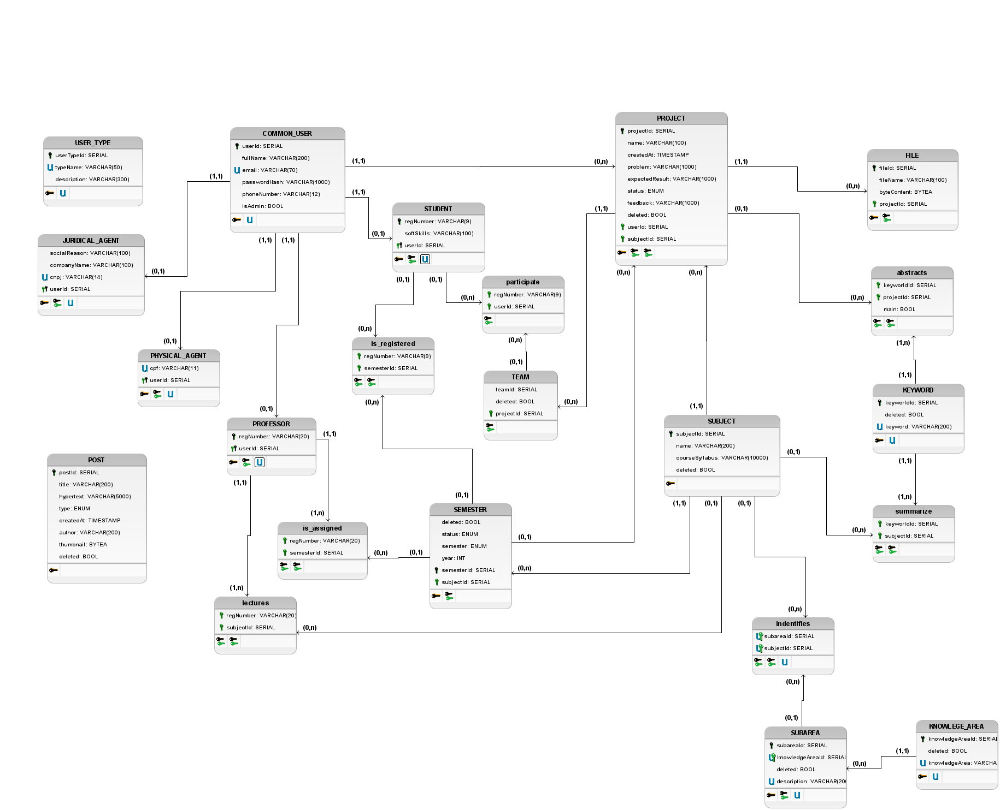

# Documento de Arquitetura

## Introdução

Este Documento de Arquitetura de Software tem como objetivo descrever os aspectos arquiteturais mais significativos da solução de software do projeto PUMA e documentar informações e decisões relevantes à arquitetura do projeto ao longo de seu desenvolvimento.

O PUMA tem como objetivo dar suporte ao curso de Engenharia de Produção da Universidade de Brasília, de maneira a possibilitar a seleção de grupos, cadastro de propostas de projetos, monitoramento de disciplinas e receber feedbacks dos stakeholders.

## Visão Geral

Estrutura do Documento:

* Introdução;
* Visão Geral;
* Definições, Acrônimos e Abreviações;
* Relações;
* Serviços;
* Tecnologias;
* Visão de Dados;

## Definições, Acrônimos e Abreviações

| Sigla | Significado                                                                |
| :---  | :------------------------------------------------------------------------  | 
| PUMA	| Plataforma Unificada de Metodologias Ativas                         |
| HTML	| Hypertext Markup Language (Linguagem de Marcação de Hipertexto)            |
| HTTP  | Hypertext Transfer Protocol (Protocolo de Transferência de Hipertexto)     |
| SQL   | Structured Query Language (Linguagem de Consulta Estruturada)              |
| API   | Application Programming Interface (Interface de Programação de Aplicações) |

## Relações

### Visão Geral da Arquitetura

A Figura 1 apresenta a visão geral da arquitetura do projeto, representando todos os microsserviços existentes e suas relações.

<figcaption>
Figura 1 - Diagrama de Visão Geral da Arquitetura
</figcaption>

## Serviços

### Front End

O [Front End](https://github.com/fga-eps-mds/2022-2-PUMA-Frontend) é a Interface de comunicação entre o usuário e o sistema.

### API Gateway

O [API Gateway](https://github.com/fga-eps-mds/2022-2-PUMA-ApiGateway) é utilizado como um _mutex_ para a comunicação entre a interface de usuário e os outros micro-serviços. Dessa forma, ao receber uma requisição o gateway atua como uma ponte entre o front end e o serviço desejado. Atualmente, esse serviço é responsável por fazer o tratamento das requisições entre os microsserviços Project-Service e User-Service.

### Project-Service

O serviço [Project-Service](https://github.com/fga-eps-mds/2022-2-PUMA-ProjectService) foi planejado para lidar com todas as tarefas envolvendo projetos do sistema. Assim, o envio de propostas, o encaminhamento para o professor/disciplina adequada e as possíveis alterações nos projetos seriam todas tarefas para o Project-Service resolver.

### User-Service

O  [User-Service](https://github.com/fga-eps-mds/2022-2-PUMA-UserService) é responsável por manter o controle de usuários, desde sua criação até o controle das rotas de acesso permitidas, criação de times dentre outros. Esse serviço é responsável por lidar com todas as operações que envolvem usuários no projeto Puma. 

### Notify-Service

O [Notify-Service](https://github.com/fga-eps-mds/2022-2-PUMA-NotifyService) lida com as notificações de alerta para usuários, por e-mail ou por meio da própria plataforma.

### Alocate-Service

O [Alocate-Service](https://github.com/fga-eps-mds/2022-2-PUMA-AlocateService) é um serviço criado para possibilitar que seja feita, de forma automática, a relação entre uma proposta feita e a disciplina a qual ela deve ser alocada.

## Tecnologias

### Vue.js

Vue.js é um framework JavaScript de código-aberto  que fornece um modelo de programação declarativo e baseado em componentes para auxiliar no desenvolvimento de  interfaces de usuário. 

### Node.js

O Node.js é um ambiente de tempo de execução JavaScript de código aberto e multiplataforma que permite a execução de códigos JavaScript fora de um navegador web.

### PostgreSQL

PostgreSQL é um sistema gerenciador de banco de dados objeto relacional de código aberto que usa e estende linguagem SQL.

### Docker

O Docker é uma plataforma de código que facilita a criação e administração de ambientes isolados que permite entregar software em pacotes chamados contêineres.

O Docker Compose é uma ferramenta para definir e executar aplicativos Docker de vários contêineres. Com o Compose, é possível utilizar um arquivo YAML para a configuração dos serviços.

## Visão de Dados

A atual modelagem dos dados é uma continuação das modelagens elaboradas nos [semestres anteriores](https://fga-eps-mds.github.io/2022-1-PUMA-Doc/produto/doc_arquitetura/) e poderá sofrer alterações ao longo do atual desenvolvimento.

A seguir, temos a visão de dados atualizada após a ultima entrega desenvolvida com todas as entidades, relacionamentos e tabelas para o projeto.

#### Modelo Entidade-Relacionamento

##### Entidades

&emsp;&emsp;COMMON_USER  
&emsp;&emsp;&emsp;&emsp;STUDENT  
&emsp;&emsp;&emsp;&emsp;PROFESSOR  
&emsp;&emsp;&emsp;&emsp;JURIDICAL_AGENT  
&emsp;&emsp;&emsp;&emsp;PHYSICAL_AGENT  
&emsp;&emsp;USER_TYPE  
&emsp;&emsp;PROJECT  
&emsp;&emsp;SUBJECT  
&emsp;&emsp;CLASS  
&emsp;&emsp;FILE  
&emsp;&emsp;SUBAREA  
&emsp;&emsp;KNOWLEDGE_AREA  
&emsp;&emsp;POST  

##### Atributos

&emsp;&emsp;COMMON_USER (**userId**, fullName, email, passwordHash, phoneNumber, isAdmin)  
&emsp;&emsp;STUDENT (regNumber, **userId**, softSkills)  
&emsp;&emsp;PROFESSOR (regNumber, **userId**)  
&emsp;&emsp;JURIDICAL_AGENT (**userId**, cnpj, cep, companyName, socialReason)  
&emsp;&emsp;PHYSICAL_AGENT (**userId**, cpf)  
&emsp;&emsp;USER_TYPE (**userTypeId**, typeName, description)  
&emsp;&emsp;PROJECT (**projectId**, name, description (problem, expectedResult, knowledgeArea))  
&emsp;&emsp;SUBAREA (**subAreaId**, description)  
&emsp;&emsp;SUBJECT (**subjectId**, name, courseSyllabus)  
&emsp;&emsp;CLASS (**classId**, subjectTerm, code, regNumber, subjectId)  
&emsp;&emsp;FILE (**fileId**, projectId, filename, byteContent)  
&emsp;&emsp;POST (**postId**, title, hypertext, type, createdAt, author, thumbnail, deleted)  

##### Relacionamentos

&emsp;&emsp;COMMON_USER - submits - PROJECT  
&emsp;&emsp;&emsp;&emsp;Um usuário submete um ou mais projetos e um projeto é proposto por apenas um usuário.  
&emsp;&emsp;&emsp;&emsp;Cardinalidade: 1:N.  
 
&emsp;&emsp;STUDENT - participates - CLASS  
&emsp;&emsp;&emsp;&emsp;Um estudante participa de uma ou mais turmas e uma turma é participada por um ou mais alunos.  
&emsp;&emsp;&emsp;&emsp;Cardinalidade: N:M  
 
&emsp;&emsp;STUDENT - executes - PROJECT  
&emsp;&emsp;&emsp;&emsp;Um estudante executa um ou mais projetos e um projeto é executado por um ou mais alunos.  
&emsp;&emsp;&emsp;&emsp;Cardinalidade: N:M  
 
&emsp;&emsp;PROFESSOR - lectures - SUBJECT  
&emsp;&emsp;&emsp;&emsp;Um professor pode lecionar várias disciplinas e uma disciplina pode ser lecionada por vários professores.  
&emsp;&emsp;&emsp;&emsp;Cardinalidade: N:M.  
 
&emsp;&emsp;PROJECT - has - FILE  
&emsp;&emsp;&emsp;&emsp;Um projeto pode possuir vários arquivos e um arquivo pertence a somente um projeto.  
&emsp;&emsp;&emsp;&emsp;Cardinalidade: 1:N.  
 
&emsp;&emsp;SUBAREA - identifies - SUBJECT  
&emsp;&emsp;&emsp;&emsp;Uma sub-área pode identificar várias disciplinas e uma disciplina é identificada por uma ou mais sub-áreas.  
&emsp;&emsp;&emsp;&emsp;Cardinalidade: N:M.  
 
&emsp;&emsp;KNOWLEDGE_AREA - contains - SUBAREA  
&emsp;&emsp;&emsp;&emsp;Uma área do conhecimento pode conter várias subáreas e uma subárea é contida por somente uma área do conhecimento.  
&emsp;&emsp;&emsp;&emsp;Cardinalidade: N:M.  

#### Diagrama Entidade-Relacionamento

<figcaption>
[Figura 2: Diagrama Entidade-Relacionamento](../assets/DER.png)
</figcaption>

#### Diagrama Lógico de Dados

<figcaption>
[Figura 3: Diagrama Lógico de Dados](../assets/DLD.png)
</figcaption>

Esses diagramas apresentam o estado atualizado dos dados, onde foi evidenciada a entidade POST e acrecentado o USER_TYPE para generalizar os tipos de perfis de usuário. Todavia, esse processo de generalização dos perfis de usuário vão impactar diretamente todos os relacionamentos que as especializações de usuário fazem. Por esse motivo, o USER_TYPE não foi relacionado ao COMMON_USER. O outra entidade que precisa ser revisada a para se relacionar com as outras é o POST que já estava implementada.

#### Dicionario de Dados

##### PROJECT
| Sigla | Tipo | Descrição |
| ----- | ---- | --------- |
| SB    | ENUM | Utilizado quando a proposta é submetida.                                           |
| RL    | ENUM | Utilizado quando professor/administrador realoca a proposta para outra disciplina. |
| AL    | ENUM | Utilizado quando a proposta não possui disciplina alocada (a disciplina adequada para a proposta não é conhecida pelo professor responsável). |
| AC    | ENUM | Utilizado quando a proposta for aceita por um professor/administrador, porém ainda não incluída a nenhum semestre.|
| RC    | ENUM | Utilizado quando a proposta for recusada por um professor/administrador.           |
| IC    | ENUM | Utilizado quando a proposta for incluída para o semestre de alguma disciplina.     |
| EX    | ENUM | Utilizado quando o(s) time(s) designado(s) inicia(m) o desenvolvimento do projeto. |
| EC    | ENUM | Utilizado quando o desenvolvimento do projeto for concluído.                       |

#### SEMESTER

| Sigla | Tipo | Descrição                                |
| ----- | ---- | ---------------------------------------- |
| AD    | ENUM | Para os semestres que estão em andamento. |
| CD    | ENUM | Para os semestres concluídos.            |

#### POST

| Sigla | Tipo | Descrição                           |
| ----- | ---- | ----------------------------------- |
| ED    | ENUM | Para publicação de editais.         |
| NT    | ENUM | Para publicação de notícias.        |
| DP    | ENUM | Para divulgar os melhores projetos. |

## Referências

About Node.js. **Node JS**. Disponível [aqui](https://nodejs.org/en/about/). Acesso em: 30 nov. 2022.

About PostgreSQL. **PostgreSQL**. Disponível [aqui](https://www.postgresql.org/about/). Acesso em: 30 nov. 2022.

Documento de Arquitetura. **Documentação PUMA 2022-1**. Disponível [aqui](https://fga-eps-mds.github.io/2022-1-PUMA-Doc/produto/doc_arquitetura/). Acesso em: 05 dez. 2022.

GUEDES, Marylene. O que é o Docker e como ele funciona? **TreinaWeb**. Disponível [aqui](https://www.treinaweb.com.br/blog/no-final-das-contas-o-que-e-o-docker-e-como-ele-funciona). Acesso em: 30 nov. 2022.

Introduction. **Vue.js Guide**. Disponível [aqui](https://vuejs.org/guide/introduction.html). Acesso em: 30 nov. 2022.

## Histórico de Revisão

| Data       | Versão | Modificação | Autor |
| :--------- | :----- | :---------- | :---- |
| 30/11/2022 | 0.1    | Criação, estruturação do documento e introdução. | Hérya    |
| 05/12/2022 | 0.2    | Adição de visão geral, definições, serviços e referências. | Hérya  |
| 06/12/2022 | 0.3    | Adição de diagrama de arquitetura. | Hérya  |
| 06/02/2023 | 1.0    | Adição da visão de dados atualizada. | Matheus  |