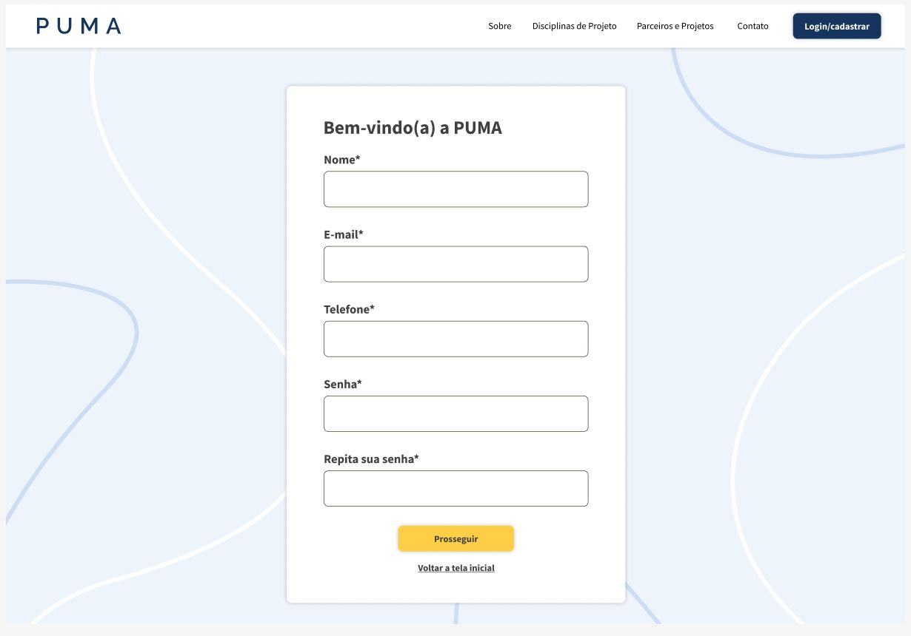
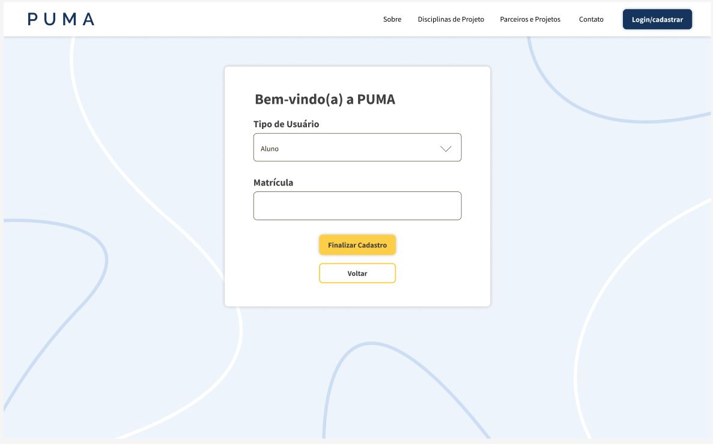
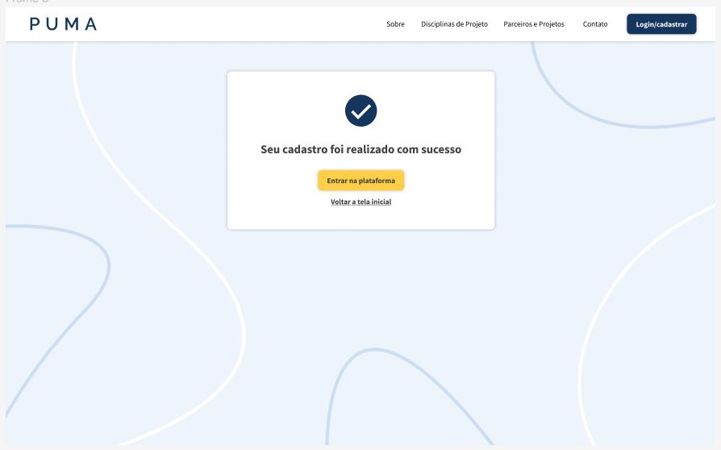
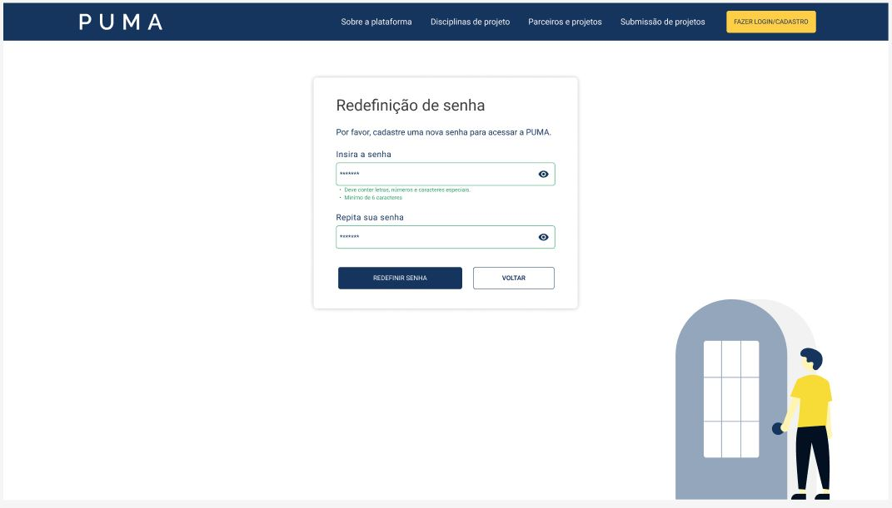

# Protótipo de Alta Fidelidade

## Introdução

Um protótipo de alta fidelidade é uma representação interativa do produto, baseada no computador ou em dispositivos móveis. Esse protótipo apresenta maior semelhança com o design final em termos de detalhes e funcionalidade. Foi desenvolvido de acordo com as funcionalidades definidas pelo cliente.

## Objetivo

Esse documento apresenta os protótipos de alta fidelidade desenvolvidos pelos alunos de PSP5 das novas páginas do PUMA.

## Protótipos

- Telas Cadastro/Login

<figcaption>
Figura 1 - Nova página de login
</figcaption>

 

<figcaption>
Figura 2 - Nova página de cadastro
</figcaption>

 

<figcaption>
Figura 3 - Página de autenticação do tipo de usuário
</figcaption>

 

<figcaption>
Figura 4 - Página de autenticação com exemplo do tipo de usuário
</figcaption>

 

<figcaption>
Figura 5 - Página de confirmação de cadastro realizado
</figcaption>

 

- [Telas recuperação de senha](https://www.figma.com/file/RYzCaFSNVzmyyJn4eB8c2V/PUMA---2%C2%BA%2F2022?node-id=240%3A484&t=4wneJHxKqsbZCaRh-4)

<figcaption>
Figura 6 - Página de solicitação de recuperação de senha
</figcaption>

 

<figcaption>
Figura 7 - Página confirmação de solicitação enviada
</figcaption>

 

<figcaption>
Figura 8 - Página criação de nova senha
</figcaption>

 

- [Telas gerenciamento de turmas](https://www.figma.com/file/RYzCaFSNVzmyyJn4eB8c2V/PUMA---2%C2%BA%2F2022?node-id=266%3A808&t=4wneJHxKqsbZCaRh-4)

<figcaption>
Figura 9 - Página de lista de turmas cadastradas
</figcaption>

 

<figcaption>
Figura 10 - Página formulário criação de nova turma
</figcaption>

 

## Histórico de revisão

| Data | Versão | Modificação | Autor |
| :--: | :----: | :---------: | :---: |
| 02/12/2022 | 1.0 | Abertura do documento.| Ailamar Alves |
| 06/12/2022 | 1.1 | Criação dos protótipos telas Cadastro/Login | Alexia |
| 10/12/2022 | 1.2 | Adição das imagens e contexto do documento| Ailamar Alves |
| 05/01/2023 | 1.3 | Criação dos protótipos recuperação de senha | Alexia e Antônio |
| 06/01/2023 | 1.4 | Criação dos protótipos gerenciamento de turmas | Alexia e Antônio |
| 08/01/2023 | 1.5 | Adição das imagens novos protótipos | Ailamar Alves |

## Referências

- TASSIOAUAD. Prototipação. Disponível em: https://tassioauad.com/2017/02/02/prototipacao/. Acesso em: dez 2022.
