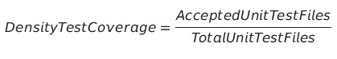
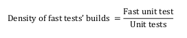
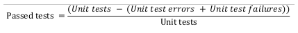
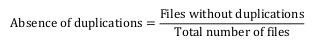
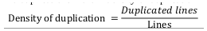
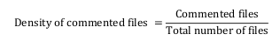
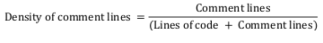
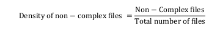

# Qualidade

## Introdução

Este documento objetiva mostrar os critérios, ferramentas e o planejamento da qualidade de código do projeto, esclarecendo o como, quais e porquês das adoções de cada prática e tipos de teste durante o desenvolvimento do produto.

## Planejamento

### Teste Unitários

Os Testes unitários são testes automatizados de pequenas unidades de código, as quais são testadas de forma isolada do restante do sistema (VALENTE, 2020).

Para a aplicação de testes unitários, a equipe utiliza o **Jest**, que é uma ferramenta de código aberto que permite realizar testes em aplicações baseadas em JavaScript de forma simples.

### SonarCloud

O **SonarCloud** é uma ferramenta utilizada para a captação de métricas e indicadores técnicos, ou seja, para o monitoramento da qualidade do projeto. Os dados coletados são utilizados para auxiliar no planejamento do aumento da qualidade do código. Durante a realização do projeto foram coletadas métricas após cada Pull Request submetido. Após coletadas, essas métricas foram combinadas para calcular cada um dos aspectos de qualidade que interessa a este Projeto, estando esses divididos em confiabilidade e manutenibilidade do código.

#### Confiabilidade

Para realizar a mensuração desse aspecto, antes é necessário realizar o cálculo do fator de qualidade Testing Status, importante para avaliar o quão confiável é o código em realizar aquilo que se propõe.

**Fator: Testing Status**

São necessárias 3 métricas para mensurar o Testing Status: Test Coverage, Fast Test Builds e Passed Tests.


##### 1. Test Coverage

Avalia a cobertura de código do projeto considerando os arquivos de teste unitários que estejam acima do limite definido sendo 60% o padrão.

<center>

</center>

##### 2. Fast Test Builds

Tem por objetivo o cálculo das builds de testes cuja duração esteja abaixo do limite de 300 segundos.

<center>

</center>

##### 3. Passed Tests

Calcula a densidade de testes unitários com sucesso. Sendo definida como:

<center>

</center>

##### Interpretação

De posse das métricas é então possível realizar o cálculo do fator de qualidade Testing Status que, por ser o único fator de qualidade que compõe o aspecto Confiabilidade, definirá o seu valor final.

```
TestingStutaus = (m4 * pm4 + m5 * pm5 + m6 * pm6) * psc2
```

Sendo as constantes da equação:
```
pm4 = 0.25
pm5 = 0.25
pm6 = 0.5
psc2 = 1
```
Em que, pm4, pm5 e pm6 são definidas como Passed Tests, Fast Test Builds e Coverage, respectivamente. O resultado final é um valor entre 0 e 1. Sendo 0 considerado a pior qualidade e 1 a melhor.

#### Manutenibilidade

**Fator: Code Quality**

As métricas descritas abaixo, são referêntes ao fator de qualidade Code Quality que compõem o aspecto de Manutenibilidade.

##### 1. Duplicidade

Essa métrica busca avaliar a quantidade de arquivos abaixo do limite definido para a porcentagem de linhas duplicadas. Onde, um arquivo é definido como não havendo duplicações se a sua densidade de duplicação é menor que 5%.

<center>

<figcaption>
Ausência de duplicações
</figcaption>
</center>

<center>

<figcaption>
Densidade de duplicações
</figcaption>
</center>

##### 2. Comentários

Tem como objetivo identificar a densidade de arquivos comentados. Um arquivo é tido como comentado se a sua densidade de linhas comentadas estiver dentro do limite definido entre 10% e 30%.

<center>

<figcaption>
Densidade de arquivos comentados
</figcaption>
</center>

<center>

<figcaption>
Densidade de linhas comentadas
</figcaption>
</center>

##### 2. Complexidade

Tem por objetivo identificar a densidade de arquivos não complexos, sendo estes definidos como os arquivos que estão fora do limite de complexidade ciclomática definido por padrão como 10.

<center>

</center>

##### Interpretação

Obtendo as 3 métricas necessárias, é feito então o cálculo do fator de qualidade Code Quality, sendo o único fator de qualidade que compõe o aspecto de qualidade Manutenibilidade e, portanto, seu resultado definirá tal aspecto.

Qualidade de Código
```
CodeQuality = (m1 * p1 + m2 * p2 + m3 * p3) * psc1
```

Sendo as constantes da equação:
```
p1 = 0.33
p2 = 0.33
p3 = 0.33
psc1 = 1
```
Em que, m1, m2 e m3 são definidas como a Complexidade, Comentários e Duplicidade, respectivamente. O resultado final é um valor entre 0 e 1. Sendo 0 considerado a pior qualidade e 1 a melhor.

### Testes Funcionais
A execução de testes funcionais baseia-se na aplicação da técnica de validação utilizada para avaliar um produto ou serviço. No projeto PUMA, os relatórios de testes funcionais são realizados pela equipe de PSP5 a partir de testes exploratórios.

## Modelo de Qualidade

De acordo com a ISO/IEC 25010, o modelo de qualidade determina quais características e subcaracterísticas de qualidade são analisadas ao avaliar as propriedades de um produto de software.

### Qualidade Interna e Externa

A norma NBR ISO/IEC 9126-1 propõe seis características principais da qualidade interna e externa, cada uma delas divididas em subcaracterísticas. A capacidade do software é determinada por um conjunto de atributos internos que podem ser medidos, para cada característica e subcaracterística.
<center>

| Característica      |  Subcaracterísticas |
| :--------- | :----- |
| Funcionalidade |  Adequação, Acurácia, Interoperabilidade, Segurança de Acesso, Conformidade |
| Confiabilidade  | Maturidade, Tolerância a, Falhas, Recuperabilidade, Conformidade |
| Usabilidade |Inteligibilidade, Apreensibilidade, Operacionalidade, Atratividade, Conformidade |
| Eficiência |  Comportamento em Relação ao Tempo, Comportamento em Relação aos Recursos, Conformidade|
| Manutenibilidade |  Analisabilidade, Modificabilidade, Estabilidade, Testabilidade, Conformidade|
| Portabilidade |  Adaptabilidade, Capacidade de Instalação, Coexistência, Capacidade de Substituição, Conformidade |

<figcaption>
Tabela 1 - Características e Subcaracterísticas do Modelo de Qualidade Interna e Externa
</figcaption>

</center>

### Qualidade Em Uso

De acordo com a norma NBR ISO/IEC 9126-1, os atributos de qualidade em uso são categorizados em quatro características: eficácia, produtividade, segurança e satisfação.

## Referências

ISO/IEC 25010. Disponível [aqui](https://iso25000.com/index.php/en/iso-25000-standards/iso-25010). Acesso em: 31 jan. 2023.


Jest. Disponível [aqui](https://jestjs.io/pt-BR/). Acesso em: 05 fev. 2023.

Norma NBR ISO/IEC 9126-1. Disponível [aqui](https://jkolb.com.br/wp-content/uploads/2014/02/NBR-ISO_IEC-9126-1.pdf). Acesso em: 31 jan. 2023.

SonarCloud. Disponível [aqui](https://www.sonarsource.com/products/sonarcloud/features/). Acesso em: 05 fev. 2023.

VALENTE, Marco. **Engenharia de Software Moderna**: Princípios e Práticas para Desenvolvimento de Software com Produtividade. 2020. Disponível [aqui](https://engsoftmoderna.info/cap8.html). Acesso em: 05 fev. 2023.


## Histórico de Revisão
| Data       | Versão | Modificação | Autor |
| :--------- | :----- | :---------- | :---- |
| 31/01/2023 | 0.1    | Criação do documento | Hérya |
| 05/02/2023 | 0.2    | Adição do tópico planejamento | Hérya |
| 05/02/2023 | 0.3    | Adição do tópico modelo de qualidade | Hérya |
| 06/02/2023 | 0.4    | Adição dos tópicos das métricas | Nilo Mendonça |
