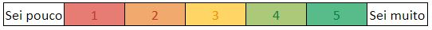
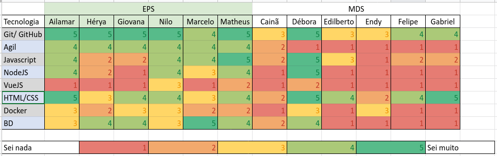
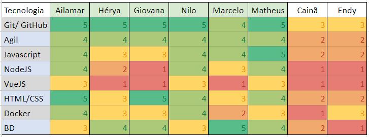

# Quadro de Conhecimento

## Introdução

O quadro de conhecimento indica o entendimento de cada membro da equipe sobre as tecnologias e habilidades necessárias no desenvolvimento do projeto. Esse conhecimento facilita em divisões de tarefas futuras, sendo possível delegar as funções de forma mais assertiva.

Cada membro deve se auto avaliar e preencher o quadro de acordo com a seguinte pontuação:

<figcaption>
Figura 1 - Legenda
</figcaption>

 

## Quadros

<figcaption>
Figura 2 - Quadro de conhecimento Semana 1
</figcaption>

 

<figcaption>
Figura 3 - Quadro de conhecimento Semana 5
</figcaption>

 

Para visualizar a planilha <a href="https://docs.google.com/spreadsheets/d/14L3V5m_9iXuynDwgmaPua71b8ALLXdMpLuKV1Orrgoc/edit#gid=0">clique aqui</a>.

## Histórico de Revisão
| Data       | Versão | Modificação | Autor |
| :--------- | :----- | :---------- | :---- |
| 25/11/2022 | 0.1    | Criação, estruturação do documento e adição do conteúdo | Nilo Mendonça |
| 11/12/2022 | 0.2    | Adição da evolução de aprendizagem dos integrantes | Ailamar Alves |
